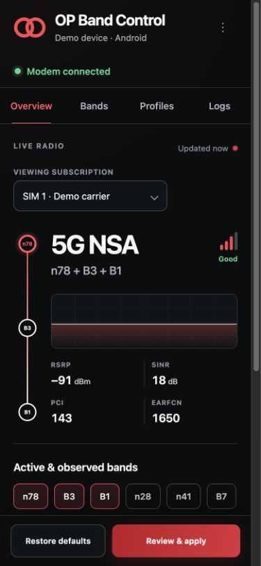

# OP Band Control

OP Band Control is an open-source KernelSU module for live LTE/5G NR monitoring and guarded, per-SIM Android band-selection requests. It detects the device, subscriptions, serving cells, observed bands, and current selection at runtime instead of using an OEM or model-specific band catalog.

> [!WARNING]
> Radio changes can interrupt data, calls, SMS, IMS/VoLTE, roaming, handover, and emergency connectivity. Do not experiment while cellular service is your only way to reach emergency services. Keep boot reapply off until a selection has been tested thoroughly.

<p align="center">
  <a href="docs/webui-concept.jpg">
    
  </a>
</p>

## Features

- Runtime device/build and SIM/subscription detection.
- Per-SIM Overview, Bands, and Profiles controls.
- Serving LTE/NR channel data, signal metrics, and carrier-aggregation state when Android exposes them.
- Runtime-discovered band candidates from active cells, observed cells, saved selections, and the current Android system selection.
- Guarded LTE/NR `RadioAccessSpecifier` requests with strict input validation.
- Exact pre-change capture and a 45-second automatic rollback after numbered restrictions.
- Manual undo, per-subscription restore data, private local logs, and opt-in boot reapply.
- Local KernelSU WebUI with no analytics, CDN, or network dependency.

## Compatibility

| Platform | Result |
| --- | --- |
| Android 12 / API 31+, KernelSU Manager with Module WebUI | Eligible; monitoring is best effort and writes remain experimental |
| Android 11 / API 30 or older | Installer blocks installation |
| Magisk, APatch, custom recovery, or a normal browser | Unsupported installation path; a normal browser shows preview data only |

The module contains shell code and architecture-neutral DEX, so it has no module-level CPU-architecture allowlist. Android 12+ and KernelSU are eligibility requirements, not a promise that every device or firmware implements the required telephony APIs. Before enabling writes, the backend verifies an active READY subscription, logical-slot mapping, exact selection readback, and the Android setter path. The modem can still reject or ignore a request.

Reported device properties and runtime observations are informational. Android has no standard API that returns a complete inventory of every numbered LTE/NR band physically supported by every modem.

## How band detection works

Each SIM gets its own detected-candidate list, built from:

1. LTE/NR bands active now.
2. Registered or nearby bands observed by Android.
3. Bands in the current system-selection restriction.
4. Bands saved for that subscription during the current session.

The list grows as Android reports more radio data. It is deliberately labeled **detected candidates**, not “all supported bands.” Mutation input uses a finite snapshot of the public LTE/NR operating-band identifiers represented by Android API 35. A detected band outside that policy remains visible as **monitor-only**. This policy validates syntax and one-way SDL/SUL safety; it is not a hardware-support claim. Actual acceptance is determined only by the selected SIM’s modem callback.

## What it cannot do

- Guarantee a hard serving-band, cell, EARFCN, or NR-ARFCN lock. Android describes the used API as a system-selection/background-scan restriction.
- Force LTE carrier aggregation, 4G+, or secondary-cell activation. The serving network and modem schedule LTE secondary cells.
- Force 5G NSA/SA, preferred network mode, or 2G/3G band selection.
- Unlock bands missing from hardware, calibration, modem configuration, carrier provisioning, or certification.
- Amplify signal or guarantee speed, latency, or coverage improvements.
- Write QMI/DIAG/NV/EFS, IMEI, RF calibration, carrier policy, IMS, or `persist.radio.*` data.
- Restart the modem, toggle airplane mode, or make SELinux permissive.

Root permits access to Android services; it cannot create a missing vendor API or override a network/modem rejection.

## Installation

1. Download `op-band-control-vX.Y.Z.zip` from the [latest release](../../releases/latest). Do not extract or rename it.
2. Optionally verify the accompanying checksum:

   ```sh
   sha256sum --check op-band-control-vX.Y.Z.zip.sha256
   ```

3. Open **KernelSU Manager → Modules → Install from storage**.
4. Select the ZIP, finish installation, and reboot.
5. Open the module WebUI and inspect Overview for every SIM before applying anything.

Do not flash the ZIP from recovery. Before updating the module or installing an Android/firmware OTA, disable **Reapply after reboot**, restore any active numbered restriction, update, reboot, and verify monitoring again.

## Using the WebUI

Select the intended SIM on Overview, Bands, or Profiles. A subscription ID is not necessarily the physical slot number.

| Profile | Behavior |
| --- | --- |
| Adaptive | Clears the current Android system-selection restriction |
| Coverage candidate | Uses detected lower-frequency candidates for the selected SIM |
| LTE+ safeguard | Leaves an already-automatic SIM untouched; removes a restriction owned by this module |
| 5G NSA candidate | Uses detected LTE anchors and NR candidates when both are available |
| Custom | Uses the exact detected candidates selected on Bands |

Unavailable numbered profiles remain disabled until enough candidates have been detected. LTE+ safeguard does not force 4G+; when the SIM is already automatic it performs zero radio writes, avoiding the reselection that previously could drop an active secondary carrier.

Supplemental-downlink and supplemental-uplink bands cannot be the entire request. The module requires at least one ordinary LTE or NR serving band, and the NSA candidate requires both an LTE anchor and a non-supplemental NR candidate.

For a numbered restriction:

1. Choose the target SIM and profile or custom bands.
2. Review the subscription and requested candidates.
3. Hold **Hold to apply**.
4. Test data, calls, SMS, and IMS/VoLTE.
5. Select **Keep this change** within 45 seconds, or undo it. If the WebUI closes, the watchdog still restores the exact previous selection when the timer expires.

Adaptive and explicit **Restore defaults** clear a non-empty system-selection restriction immediately and do not use the 45-second confirmation timer. Restore defaults can also clear a restriction created by another tool or the firmware, so use it deliberately.

Boot reapply is off by default and becomes available only after a numbered selection has been confirmed. A failed boot reapply disables itself instead of retrying indefinitely.

Baselines are saved per subscription, but the module tracks one current owned/reapply configuration at a time. Applying a confirmed numbered selection to another SIM replaces that current ownership record; restore and test one SIM at a time.

## Recovery and uninstall

Use the first available method:

1. WebUI → select the affected SIM → **Restore defaults**.
2. Run the module action in KernelSU Manager.
3. From a root shell, replace `5` with a `subId` returned by `status`:

   ```sh
   su -c 'sh /data/adb/modules/opbandcontrol/bin/control.sh reset 5'
   ```

4. For a pending change, use **Undo now** or wait for automatic rollback.

Before uninstalling, restore every active SIM where possible. Remove the module in KernelSU Manager and reboot. The uninstall script attempts every captured per-subscription baseline; recovery state is retained under `/data/adb/opband-control` if an unavailable SIM cannot be restored.

## Troubleshooting

| Message | Meaning |
| --- | --- |
| **Read-only on this firmware** | Subscription/slot/readback/setter verification did not complete; root alone cannot make it writable |
| **MODEM_REJECTED** | The modem refused the request |
| **CALLBACK_TIMEOUT** | The firmware did not acknowledge it in time |
| **Another radio change is in progress** | Wait for the bounded operation and retry; do not delete lock files manually |
| **PENDING_CHANGE** | Keep, undo, or wait for the rollback watchdog |
| Only one SIM or incorrect service state | Wait for SIM unlock/telephony startup, then collect status diagnostics |

Useful diagnostics:

```sh
su -c 'sh /data/adb/modules/opbandcontrol/bin/control.sh status'
su -c 'sh /data/adb/modules/opbandcontrol/bin/control.sh status 5'
su -c 'sh /data/adb/modules/opbandcontrol/bin/control.sh selection 5'
su -c 'sh /data/adb/modules/opbandcontrol/bin/control.sh settings'
su -c 'sh /data/adb/modules/opbandcontrol/bin/control.sh logs 200'
su -c 'sh /data/adb/modules/opbandcontrol/bin/control.sh set-reapply off'
```

Replace `5` with a numeric subscription ID from `status`. Before posting output publicly, review and redact carrier names, subscription IDs, PCI/channel/frequency details, build fingerprints, and pending/restore tokens. The module does not intentionally query IMSI, IMEI, or phone numbers.

## Building locally

Requirements:

- JDK 17+ (`javac` and `jar`)
- Android SDK Platform 35
- Android SDK Build Tools **35.0.0** with `d8`
- Node.js 20+
- POSIX shell tools, `zip`, and `unzip`

Set `ANDROID_SDK_ROOT` or `ANDROID_HOME`, then run:

```sh
npm run check
npm run build
```

The build recompiles the privileged helper, runs controller/UI/static tests, validates the module, and writes `dist/op-band-control-vX.Y.Z.zip` with KernelSU files at the ZIP root.

## GitHub release workflow

The included [release workflow](.github/workflows/release.yml) validates pushes and pull requests and uploads a short-lived build artifact. A tag publishes a GitHub Release only when all of these versions match:

- `module.prop` → `version`
- `package.json` → `version`
- Git tag → `vX.Y.Z`

Release steps:

1. Update both version files and increase `versionCode`.
2. Update the WebUI `?v=` cache-busting values in `webroot/index.html`.
3. Run `npm run check`, `npm run build`, and `unzip -t dist/op-band-control-vX.Y.Z.zip`.
4. Commit through the project’s normal reviewed workflow.
5. Create and push the matching tag.

The workflow verifies the ZIP, produces a `.zip.sha256` file, and attaches both files to the release. `workflow_dispatch` builds an artifact without publishing a release.

## Contributing and security

Issues and pull requests are welcome. Run `npm run check` and `npm run build`, keep root arguments allowlisted, preserve exact rollback behavior, and add tests for radio/parser/UI changes. Proposals that guess Binder transaction IDs, modify QMI/DIAG/NV/EFS or identifiers, disable thermal protection, make SELinux permissive, or promise forced carrier aggregation will not be accepted.

For a vulnerability, use GitHub’s private **Security → Report a vulnerability** flow when available. Do not put subscriber data, live recovery tokens, or exploit details in a public issue.

This project is licensed under the [Apache License 2.0](LICENSE). Bundled attribution is in [THIRD_PARTY_NOTICES.md](THIRD_PARTY_NOTICES.md).

## Sources and validation

- [KernelSU module guide](https://kernelsu.org/guide/module.html)
- [KernelSU Module WebUI](https://kernelsu.org/guide/module-webui.html)
- [Android `TelephonyManager`](https://developer.android.com/reference/android/telephony/TelephonyManager)
- [Android `PhysicalChannelConfig`](https://developer.android.com/reference/android/telephony/PhysicalChannelConfig)
- [Android `RadioAccessSpecifier`](https://developer.android.com/reference/android/telephony/RadioAccessSpecifier)
- [AOSP Radio HAL `IRadioNetwork`](https://android.googlesource.com/platform/hardware/interfaces/+/e8c4d8246f4e213b9579b8be4e1097c926ba6d93/radio/aidl/android/hardware/radio/network/IRadioNetwork.aidl)
- [ETSI / 3GPP TS 38.101-1 NR operating bands](https://www.etsi.org/deliver/etsi_TS/138100_138199/13810101/17.16.00_60/ts_13810101v171600p.pdf)
- [3GPP carrier aggregation overview](https://www.3gpp.org/technologies/101-carrier-aggregation-explained)

Repository tests cover helper compilation, controller fixtures, rollback rules, UI logic, browser interaction, responsive layout, CSP, and ZIP structure. Physical-device behavior still depends on Android framework and modem/HAL implementation, so radio writes remain experimental and fail closed when runtime verification is unavailable.
