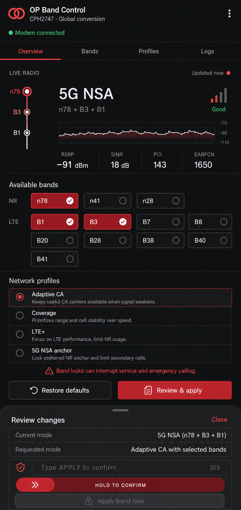

# OP Band Control

OP Band Control is an open-source KernelSU module for inspecting LTE/NR radio state and making guarded Android system-selection requests. It is designed for the OnePlus 15 reporting model `CPH2747`, with OxygenOS 16 as the primary experimental target.

> [!WARNING]
> Radio changes can interrupt mobile data, calls, SMS, IMS/VoLTE, roaming, handover, and emergency connectivity. Do not test while cellular service is your only way to reach emergency services. Keep **Reapply after reboot** off until a specific restriction has been tested thoroughly.

<p align="center">
  <a href="docs/webui-concept.png">
    
  </a>
</p>

## Contents

- [Features](#features)
- [What it does not do](#what-it-does-not-do)
- [Compatibility](#compatibility)
- [Installation](#installation)
- [Using the WebUI](#using-the-webui)
- [Recovery and uninstall](#recovery-and-uninstall)
- [Troubleshooting](#troubleshooting)
- [Building locally](#building-locally)
- [Creating a GitHub release](#creating-a-github-release)
- [Contributing](#contributing)
- [Privacy, security, and license](#privacy-security-and-license)

## Features

- Per-subscription SIM selector on Overview, Bands, and Profiles.
- Live serving-cell information from Android `PhysicalChannelConfig`, including exposed primary and secondary LTE/NR carriers.
- Registered and nearby bands observed through Android telephony cell information.
- Separate labels for **CPH2747 advertised**, **observed nearby**, and **active now** bands.
- Guarded, allowlisted LTE/NR `RadioAccessSpecifier` requests through Android's system-selection channel API.
- Exact pre-change baseline capture and a 45-second rollback watchdog after numbered band-restriction writes.
- Idempotent LTE+ safeguard: applying it while the selected SIM is already automatic performs **zero radio writes**.
- Automatic rollback, manual undo, per-subscription baseline restoration, private operation logs, and opt-in boot reapply.
- Local WebUI assets, restrictive Content Security Policy, and no analytics or network dependency.

## What it does not do

This module does **not**:

- Guarantee a hard serving-band, cell, EARFCN, or NR-ARFCN lock. Android documents the used API as a system-selection/background-scan restriction, and an OEM radio HAL may reject, ignore, or only partially implement it.
- Force LTE carrier aggregation, 4G+, or secondary-cell activation. The serving network and modem scheduler configure and activate LTE SCells.
- Force 5G NSA/SA, a preferred network mode, or 2G/3G band selection.
- Unlock RF bands missing from the physical antennas, filters, calibration, modem configuration, carrier provisioning, or certification.
- Amplify signal or guarantee higher speed, lower latency, or better coverage.
- Write Qualcomm QMI/DIAG/NV/EFS data, IMEI, RF calibration, carrier policy, IMS settings, or `persist.radio.*` properties.
- Restart the modem, toggle airplane mode, or make SELinux permissive.

Root access grants permission to call available Android services; it cannot create a missing vendor API or override a modem/network rejection.

## Compatibility

### Requirements

- Android 12 / API 31 or newer
- 64-bit ARM (`arm64` / `arm64-v8a`)
- KernelSU Manager with Module WebUI support
- A firmware radio implementation that exposes the required Android telephony APIs

Android 12 is the technical installation floor, not a claim that every Android 12+ ROM is supported.

| Device / platform | Installation | Monitoring | Band requests | Support level |
| --- | --- | --- | --- | --- |
| OnePlus 15 `CPH2747`, OxygenOS 16 / Android 16, arm64, KernelSU | Yes | Best effort | Experimental and verified per request | Primary experimental target |
| Chinese/converted hardware reporting `CPH2747` with global firmware | Yes | Best effort | Unverified | Experimental; monitor first and keep boot reapply off |
| Other OnePlus device, Android 12+, arm64, KernelSU | Installer warns but allows | May work | Unsupported: the bundled numbered-band catalog is CPH2747-specific | Monitoring-only best effort |
| Other OEM, Android 12+, arm64, KernelSU | Installer warns but allows | May work | Unsupported | Monitoring-only best effort |
| Android 11 / API 30 or older | Installer aborts | No | No | Unsupported |
| 32-bit ARM, x86, or x86_64 Android | Installer aborts | No | No | Unsupported |
| Magisk, APatch, custom recovery, or a normal browser | Unsupported installation/UI path | Browser shows preview/mock data only | Not supported | Use KernelSU Manager |

The current build uses the official CPH2747 LTE/NR catalog for all mutation validation. The installer warns on a different manufacturer or model but does not hard-block it, so **do not apply numbered profiles on other devices**.

### Converted-device warning

A property such as `ro.product.model=CPH2747` identifies the running firmware, not the original RF hardware. Global firmware cannot add missing antennas, filters, calibration, modem capabilities, carrier provisioning, or certification. Treat a converted Chinese device as unverified hardware even when the WebUI reports CPH2747.

### Firmware updates

An OxygenOS or Android OTA can change hidden/System APIs and vendor RIL behavior. Disable boot reapply before an OTA, reboot after updating, and re-test monitoring and recovery before applying another restriction.

## Installation

### From GitHub Releases

1. Open this repository's [Releases page](../../releases/latest).
2. Download `op-band-control-vX.Y.Z.zip`. Do not extract or rename it.
3. Optionally download the matching `.zip.sha256` file and verify it on a computer:

   ```sh
   sha256sum --check op-band-control-vX.Y.Z.zip.sha256
   ```

4. Open **KernelSU Manager → Modules → Install from storage**.
5. Select the ZIP and review the installer warnings.
6. Reboot the phone.
7. Open OP Band Control from the module's WebUI button.
8. Inspect Overview for each SIM before applying anything. Fresh installs start with boot reapply off.

Do not flash this ZIP from custom recovery. Magisk and APatch are not supported by this build.

### Updating

1. Disable **Reapply after reboot**.
2. If this module currently owns a numbered restriction, restore that SIM to automatic selection first.
3. Install the newer ZIP over the existing module in KernelSU Manager.
4. Reboot and verify both SIMs again before making another request.

Configuration under `/data/adb/opband-control` may survive an update, so an earlier opt-in boot setting should not be assumed to reset automatically.

## Using the WebUI

### Data labels

- **CPH2747 advertised**: static list from OnePlus documentation; not proof of a converted device's physical RF chain.
- **Observed nearby**: cached or partial Android cell data; not a complete modem capability list.
- **Active now**: serving channels reported by Android. Secondary carriers can disappear while traffic is idle.

Android does not provide a standard API that enumerates every numbered LTE/NR band configured in a modem.

### Profiles

| Profile | Behavior | Important limitation |
| --- | --- | --- |
| Adaptive | Clears the current Android system-selection restriction for the selected subscription | May also clear an OEM or third-party restriction; use deliberately |
| Coverage | Restricts scanning to observed lower-frequency candidates | Deployment is carrier/country specific and service can be lost |
| LTE+ safeguard | Leaves an automatic SIM untouched; clears a restriction only when this module proves ownership on that same subscription | Does not force 4G+; it prevents this module from excluding a valid CA combination |
| 5G NSA candidate | Keeps observed LTE anchors and NR candidates eligible | Requires carrier-side NSA and a compatible LTE anchor |
| Custom | Uses the exact LTE/NR choices selected on Bands | Expert use; easy to interrupt service |

`B32` and `n75` are supplemental-downlink bands. The UI and backend reject them as the only selected bands. The NSA profile also requires an ordinary LTE anchor.

### Applying a numbered restriction

1. Choose the target SIM on Profiles or Bands. The displayed subscription ID is not necessarily the physical slot number.
2. Choose a profile or manual LTE/NR bands.
3. Select **Review & apply** and verify the subscription and requested bands.
4. Hold **Hold to apply**. Keyboard and switch users press Enter twice.
5. Test mobile data, calls, SMS, IMS/VoLTE, roaming, and handover.
6. Select **Keep this change** before the 45-second timer expires, or select **Undo now**.

Closing KernelSU does not cancel the watchdog. If confirmation never arrives, the controller restores the exact pre-change selection.

### Immediate actions

- Applying LTE+ safeguard to an already-automatic SIM is an immediate no-op and should report `"changed":false,"noOp":true`; no watchdog is necessary because no radio write occurred.
- Adaptive and **Restore defaults** clear a non-empty system-selection restriction immediately.
- Restore defaults is intentionally broader than LTE+ safeguard. It can clear a restriction created by an OEM or another tool, so use it only when that is intended.

### Boot reapply

Boot reapply is off by default on a fresh installation. It is available only after a numbered restriction has been confirmed. A failed boot reapply disables itself instead of retrying indefinitely.

Only one current confirmed/reapply configuration is tracked at a time, although uninstall baselines are captured separately per subscription. A vendor may also implement a nominally per-subscription policy modem-wide; test one SIM at a time.

## Recovery and uninstall

Use the first recovery method that remains available:

1. WebUI → choose the affected SIM → **Restore defaults**.
2. KernelSU's module action button. It targets the preferred active subscription, normally the active/default-data SIM.
3. From a root shell, replacing the example ID `5` with the numeric subscription ID reported by `status`:

   ```sh
   su -c 'sh /data/adb/modules/opbandcontrol/bin/control.sh reset 5'
   ```

4. If a change is pending, wait for the 45-second watchdog or use **Undo now**.

Before uninstalling, restore every active SIM on which this module applied a restriction when possible. Then remove the module in KernelSU Manager and reboot. `uninstall.sh` attempts to restore every captured per-subscription baseline. If a SIM is unavailable or a restore fails, the private fallback state is intentionally retained under `/data/adb/opband-control` for later recovery.

## Troubleshooting

| Symptom | Meaning / action |
| --- | --- |
| **Read-only on this firmware** or disabled apply buttons | The backend could not verify the subscription, READY SIM/slot mapping, exact selection read, or setter API. Root alone cannot make this writable. |
| **MODEM_REJECTED** or **CALLBACK_TIMEOUT** | The firmware/modem rejected the request or did not acknowledge it. Restore defaults if needed; do not retry continuously. |
| Only one SIM appears, or service is shown incorrectly | Confirm both SIMs are enabled and unlocked, then collect status diagnostics after telephony has finished starting. |
| **Another radio change is in progress** | Wait for the bounded operation and retry. Do not manually delete lock files while a controller process may be live. |
| **PENDING_CHANGE** | Keep or undo the pending change in the WebUI, or wait for automatic rollback. |
| LTE+ changed from 4G+ to plain 4G on an older build | Upgrade to v0.1.5 or newer. With automatic selection, LTE+ safeguard now makes zero radio writes. |

### Diagnostic commands

```sh
# All detected subscriptions and the preferred subscription
su -c 'sh /data/adb/modules/opbandcontrol/bin/control.sh status'

# Example ID 5 must be replaced with a numeric subId from status;
# a subscription ID is not the SIM slot number
su -c 'sh /data/adb/modules/opbandcontrol/bin/control.sh status 5'
su -c 'sh /data/adb/modules/opbandcontrol/bin/control.sh selection 5'

# Saved profile, owner subscription, boot reapply, and pending state
su -c 'sh /data/adb/modules/opbandcontrol/bin/control.sh settings'

# Recent privacy-filtered controller events
su -c 'sh /data/adb/modules/opbandcontrol/bin/control.sh logs 200'

# Disable boot reapply without changing the current radio selection
su -c 'sh /data/adb/modules/opbandcontrol/bin/control.sh set-reapply off'
```

Before posting diagnostics publicly, inspect and redact carrier/display names, subscription IDs, PCI/channel/frequency details, build fingerprints, and pending/restore tokens as appropriate. The module does not intentionally query IMSI, IMEI, or phone numbers.

For a useful bug report, include:

- Manufacturer, exact device model, and whether the hardware was region-converted
- Android version, ROM name/version, and KernelSU Manager version
- Whether the SIM is physical/eSIM and single-SIM/dual-SIM
- The exact action performed and whether service recovered automatically
- Redacted `status`, `selection <subId>`, `settings`, and `logs 200` output

## Building locally

### Requirements

- JDK 17 or newer, providing `javac` and `jar`
- Android SDK Platform 35
- Android SDK Build Tools **35.0.0** with `d8`
- Node.js 20 or newer
- POSIX shell tools, `zip`, and `unzip`

Set `ANDROID_SDK_ROOT` or `ANDROID_HOME` to the Android SDK. The project has no npm runtime dependencies, so no `npm install` step is required.

```sh
npm run check
npm run build
```

`npm run check` validates shell scripts, controller behavior, JavaScript syntax, backend/UI regression tests, CSP, and safety invariants. `npm run build` rebuilds `bin/opband.jar`, reruns validation, and creates:

```text
dist/op-band-control-v<module.prop version>.zip
```

The ZIP has KernelSU module files at its root; do not wrap them in another directory.

### Repository layout

| Path | Purpose |
| --- | --- |
| `helper-src/` | Privileged Java telephony helper compiled to `bin/opband.jar` |
| `bin/control.sh` | Allowlisted root controller, state, lock, watchdog, and rollback logic |
| `webroot/` | Local KernelSU Module WebUI |
| `tests/` | Controller fixtures and backend/UI regression tests |
| `scripts/` | Helper build, validation, and ZIP packaging |
| `.github/workflows/release.yml` | CI build and tagged GitHub Release automation |

## Creating a GitHub release

The included GitHub Actions workflow validates pull requests and pushes, produces a downloadable Actions artifact, and publishes a GitHub Release only for a matching version tag.

### Release checklist

1. Update `version` and increase `versionCode` in `module.prop`.
2. Set the same semantic version in `package.json`.
3. Update the `?v=` cache-busting values for `app.css` and `app.js` in `webroot/index.html`.
4. Update release notes/documentation and run:

   ```sh
   npm run check
   npm run build
   unzip -t dist/op-band-control-vX.Y.Z.zip
   ```

5. Commit the release changes using your normal reviewed workflow.
6. Create and push an exact matching tag:

   ```sh
   git tag vX.Y.Z
   git push origin vX.Y.Z
   ```

For example, `module.prop` version `0.2.0` requires tag `v0.2.0`. A mismatched or malformed tag fails before publishing.

On a valid tag, the workflow:

1. Uses JDK 17, Node.js 22, Android Platform 35, and Build Tools 35.0.0.
2. Verifies `module.prop`, `package.json`, `versionCode`, and the tag.
3. Runs all validation/tests and builds the installable ZIP.
4. Checks ZIP integrity and the embedded module version.
5. Generates and verifies a SHA-256 checksum.
6. Uploads the ZIP and checksum as a short-lived Actions artifact.
7. Creates a GitHub Release with generated notes and attaches both files.

A manual `workflow_dispatch` run builds and uploads an Actions artifact, but does not publish a GitHub Release. The workflow defaults to read-only repository permission; only the tag release job receives `contents: write`.

## Contributing

Issues and pull requests are welcome. Keep changes narrowly scoped and explain any radio behavior assumptions.

Before opening a pull request:

1. Run `npm run check` and `npm run build`.
2. Preserve strict argument allowlists between the WebUI and root controller.
3. Keep writes reversible, subscription-specific, and guarded by exact pre-change capture.
4. Add regression tests for parser, dual-SIM, rollback, and UI state changes.
5. Clearly label behavior that has not been verified on physical hardware.

Proposals that guess Binder transaction numbers, write QMI/DIAG/NV/EFS or identifiers, disable thermal protection, make SELinux permissive, or promise forced carrier aggregation will not be accepted.

## Privacy, security, and license

- No analytics, telemetry upload, remote JavaScript, CDN, or external frame is used by the module.
- Controller logs are stored privately and intentionally omit subscriber identities and precise cell identifiers.
- WebUI commands use argument arrays; the root controller independently validates verbs, profiles, subscription IDs, bands, and tokens.
- KernelSU configuration is used when available, with a private persistent fallback at `/data/adb/opband-control`.

For a security vulnerability, prefer GitHub's private **Security → Report a vulnerability** flow when enabled. Do not publish sensitive exploit details, subscriber data, or live recovery tokens in a public issue.

This project is licensed under the [Apache License 2.0](LICENSE). See [THIRD_PARTY_NOTICES.md](THIRD_PARTY_NOTICES.md) for bundled third-party attribution.

## Sources

- [KernelSU module guide](https://kernelsu.org/guide/module.html)
- [KernelSU Module WebUI](https://kernelsu.org/guide/module-webui.html)
- [OnePlus 15 CPH2747 quick guide](https://www.oneplus.com/content/dam/oneplus/2024/eu/store/safety_guide/OnePlus_15_Quick_Guide.pdf)
- [Android `PhysicalChannelConfig`](https://developer.android.com/reference/android/telephony/PhysicalChannelConfig)
- [Android 16 `TelephonyManager`](https://android.googlesource.com/platform/frameworks/base/+/refs/heads/android16-release/telephony/java/android/telephony/TelephonyManager.java)
- [AOSP Radio HAL `IRadioNetwork`](https://android.googlesource.com/platform/hardware/interfaces/+/e8c4d8246f4e213b9579b8be4e1097c926ba6d93/radio/aidl/android/hardware/radio/network/IRadioNetwork.aidl)
- [3GPP carrier aggregation overview](https://www.3gpp.org/technologies/101-carrier-aggregation-explained)

## Validation status

The repository includes static validation, helper compilation, controller fixtures, unit/regression tests, browser interaction checks, responsive WebUI checks, and ZIP-layout verification. These tests do not replace real-device modem testing. Repository-based validation has not established universal support for CPH2747/OxygenOS 16 or any other firmware, so all radio writes remain experimental and fail closed where capability cannot be verified.
